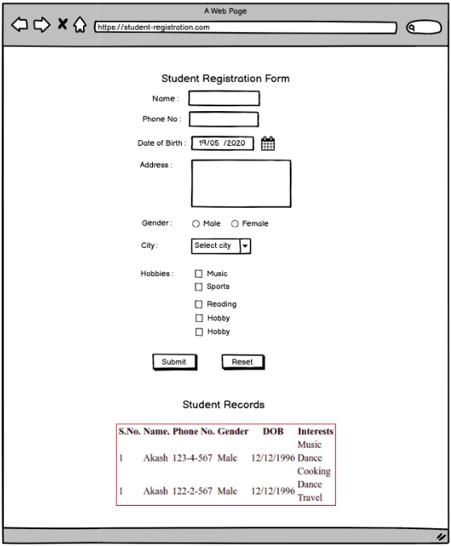

# Assignment 2 - Advanced HTML
## Design and create a webpage with HTML form and a table. It must include the following :
- Name
- Phone number
- Date of birth
- Address
- Gender 
- City - dropdown
- Hobbies - checkbox
- Submit button  - to submit form
- Reset button - to reset form
- A static table to display 3 records - columns (SNo, Name, Phone no, Gender, City, Hobbies(hobbies will span over multiple rows))
All form elements must only allow valid input.
For illustration, you can refer to the attached document.

